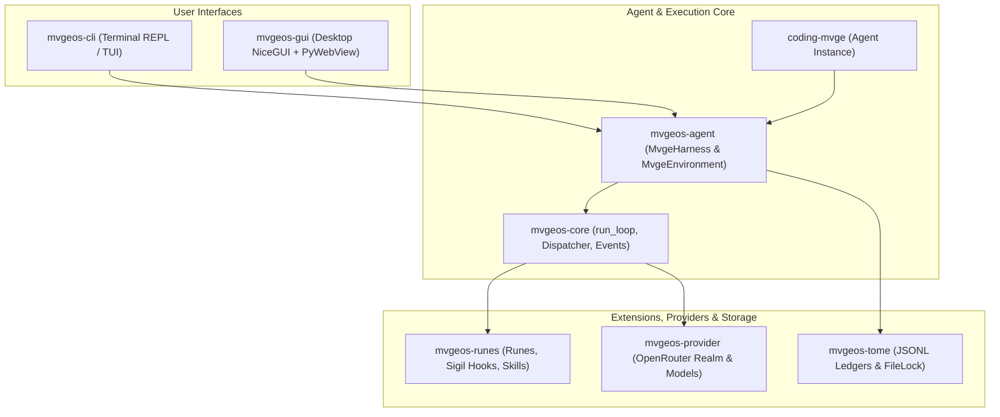

# 🧙‍♂️ MvgeOS

[](https://www.python.org/downloads/)
[](https://github.com/astral-sh/uv)
[](https://github.com/astral-sh/ruff)
[](https://mypy-lang.org/)
[](https://opensource.org/licenses/MIT)
[]()
[]()

> **MvgeOS** is a modern, extensible, protocol-compliant AI coding agent architecture built in Python.

Mvges (Agents) invoke Spells (Tools) across Models through Realms (Providers) on behalf of Summoners (Users), storing state and conversation history in Pi-compatible JSONL Tomes (Sessions). See [Architecture Provenance](docs/architecture/PROVENANCE.md) for ecosystem inspirations and the cross-harness continuity roadmap.

---

## ✨ Features

- ⚡ **Event-Driven Agent Loop (`mvgeos-agent`)**: Stream-centric execution loop with parallel spell dispatching, turn management, and automatic context compaction.
- 🌐 **Multi-Model Provider Abstraction (`mvgeos-provider`)**: Full OpenRouter integration supporting 60+ LLMs with automatic retry, exponential backoff, rate-limit handling, and reasoning effort configuration.
- 📜 **Pi-Compatible JSONL Persistence (`mvgeos-tome`)**: Session storage format fully compatible with Pi, featuring cross-process file locking, tree branching/forking, and in-memory index caching.
- 🔮 **Rune Extension Ecosystem (`mvgeos-runes`)**: Hot-reloadable extension modules with 23 lifecycle Sigil hooks, command registration, and host-isolated process sandboxing.
- 🖥️ **Desktop GUI (`mvgeos-gui`)**: Native desktop interface powered by NiceGUI and PyWebView offering a 1:1 Antigravity layout with interactive chat, step cards, floating dock, file tree, diff review, and artifact inspector.
- ⌨️ **Rich CLI & TUI (`mvgeos-cli`)**: Full terminal interface featuring an interactive REPL with prompt-toolkit, terminal dashboard, and system diagnostic tooling.
- 🛠️ **Full-Featured Coding Agent (`coding-mvge`)**: Pre-configured agent with built-in spells for bash execution, file reading, editing, creation, grep searching, and directory listing.

---

## 🏛️ Monorepo Architecture

MvgeOS is organized as a monorepo powered by `uv` workspaces:

| Package | Purpose |
| --- | --- |
| [`mvgeos-core`](mvgeos-core/AGENTS.md) | Canonical loop vocabulary: abort primitives, invocations, spells, events, pure turn loop (zero first-party deps) |
| [`mvgeos-agent`](mvgeos-agent/AGENTS.md) | Core Mvge loop, invocations, state, spell execution, and MvgeHarness session lifecycle |
| [`mvgeos-provider`](mvgeos-provider/AGENTS.md) | Realm protocol, model registry, retry policies, and OpenRouter provider |
| [`mvgeos-tome`](mvgeos-tome/AGENTS.md) | JSONL session persistence with cross-process file locking and in-memory index |
| [`mvgeos-runes`](mvgeos-runes/AGENTS.md) | Extension system: manifest parser, loader, watcher, and sigil hooks |
| [`mvgeos-cli`](mvgeos-cli/AGENTS.md) | CLI commands (`mvgeos`), REPL, and TUI interface |
| [`mvgeos-gui`](mvgeos-gui/AGENTS.md) | Native desktop application powered by NiceGUI with 1:1 Antigravity UI |
| [`coding-mvge`](coding-mvge/AGENTS.md) | Concrete coding agent implementation with built-in development spells |



---

## 📖 MvgeOS Terminology

MvgeOS adopts a consistent domain language across all packages:

| Standard Concept | MvgeOS Term | Description |
| --- | --- | --- |
| **Agent** | `Mvge` | The autonomous agent entity |
| **User** | `Summoner` | The human interacting with the agent |
| **Tool** | `Spell` | Executable capability invoked by the Mvge |
| **Token** | `Mana` | Unit of context and computation budget |
| **Context Window** | `Mana Pool` | Total token capacity available |
| **Provider** | `Realm` | LLM backend service (e.g. OpenRouter) |
| **Session** | `Tome` | JSONL persistent session log |
| **Message** | `Invocation` | Turn message between Summoner and Mvge |
| **Streaming** | `Channeling` | Real-time token streaming from Realm |
| **Extension** | `Rune` | Plugin module extending Mvge capabilities |
| **Callback / Hook** | `Sigil` | Lifecycle event handler |
| **Reasoning Effort** | `Contemplation` | Thought generation configuration |

---

## 🚀 Quick Start

### Prerequisites

- **Python**: `>= 3.13`
- **Package Manager**: [`uv`](https://github.com/astral-sh/uv)
- **API Key**: [OpenRouter API Key](https://openrouter.ai/)

### Installation

```bash
# Clone the repository
git clone https://github.com/IAmNo1Special/mvgeos.git
cd mvgeos

# Install workspace dependencies
uv sync
```

### Environment Configuration

Copy the example configuration or set your OpenRouter API key directly:

```bash
# Copy template to .env
cp .env.example .env

# Or export in shell (Linux / macOS)
export OPENROUTER_API_KEY="your-openrouter-api-key"

# Windows PowerShell
$env:OPENROUTER_API_KEY="your-openrouter-api-key"
```

### Launching MvgeOS

```bash
# Run a single prompt via CLI
uv run mvgeos "Explain the project architecture"

# Start the interactive terminal REPL
uv run mvgeos

# Launch the native Desktop GUI (NiceGUI + PyWebView)
uv run mvgeos-gui

# Serve the GUI to your web browser
uv run mvgeos-gui --web --port 8000
```

---

## ⚙️ Configuration & `.agents` Protocol

MvgeOS complies with the [dotagents protocol](https://dotagentsprotocol.com). Configuration data is stored under `.agents/.mvgeos/`:

```text
~/.agents/.mvgeos/
├── runes/
│   └── manifest.json    # Rune extension registry
├── tomes/               # Session JSONL storage
├── auth/                # API keys and credentials
└── models.json          # Custom model configurations
```

### Environment Variables

| Variable | Type | Default | Description |
|---|---|---|---|
| `OPENROUTER_API_KEY` | string | *Required* | Primary API key for OpenRouter LLM inference |
| `MVGEOS_API_KEY` | string | *Optional* | Fallback / alias API key for MvgeOS operations |
| `GEMINI_API_KEY` | string | *Optional* | API key for Gemini models |
| `GOOGLE_API_KEY` | string | *Optional* | API key for Google Cloud / Gemini endpoints |
| `STORAGE_SECRET` | string | *Auto-generated* | Secret key used to encrypt NiceGUI desktop session storage |
| `MVGEOS_LOG_DIR` | string | `.logs` | Custom runtime log directory path |
| `MVGEOS_LOG_LEVEL` | string | `INFO` | Runtime log verbosity level (`DEBUG`, `INFO`, `WARNING`, `ERROR`) |
| `MVGEOS_DB_PATH` | string | `~/.agents/.mvgeos/state.db` | Custom SQLite database path for desktop GUI state |
| `MVGEOS_WORKSPACE_ROOT` | string | Current working directory | Authorized root directory boundary for file and bash spell operations |
| `MVGEOS_BASH_TIMEOUT_MS` | integer | `600000` (10 min) | Default spell execution timeout in milliseconds |
| `EDITOR` | string | System default | External text editor command for editing configurations or notes |

---

## 🧩 Dependency Setup for Runes

Runes can declare both Python and system dependencies. Use `mvgeos setup` to inspect and install them:

```bash
# Check required dependencies
uv run mvgeos setup check

# Interactively install missing dependencies
uv run mvgeos setup install

# Non-interactively install all dependencies
uv run mvgeos setup install --yes

# Dry-run preview of installation actions
uv run mvgeos setup install --dry-run
```

---

## 🧪 Quality Gates & Development

All code in MvgeOS is developed using strict TDD (Test-Driven Development) and adheres to rigorous quality gates:

```bash
# Run complete test suite with coverage
uv run python -m pytest --cov

# Run type checker in strict mode
uv run mypy .

# Run linter
uv run ruff check

# Verify formatting
uv run ruff format --check
```

---

## 🔒 Security & Architecture Provenance

- **Security Policy**: For vulnerability reporting, prompt injection threat models, and local execution safeguards, review [SECURITY.md](SECURITY.md).
- **Architecture Provenance**: To learn about the origins of MvgeOS, its ecosystem inspirations (Pi, Google ADK, Eve, arXiv literature), and the cross-harness session continuity roadmap, review [PROVENANCE.md](docs/architecture/PROVENANCE.md).

---

## 📦 Releases & Changelog

- **Changelog**: Managed via [`git-cliff`](https://github.com/orhun/git-cliff) using conventional commits.
- **Workflow**: Automated release workflow in `.github/workflows/release.yml`.

```bash
# Preview unreleased changes
uv run git-cliff --config cliff.toml --unreleased

# Generate updated CHANGELOG.md
uv run git-cliff --config cliff.toml --output CHANGELOG.md
```

---

## 📄 License

This project is licensed under the [MIT License](LICENSE).

---

<div align="center">
  <sub>Made with ❤️ for developers and autonomous agent builders.</sub>
</div>
