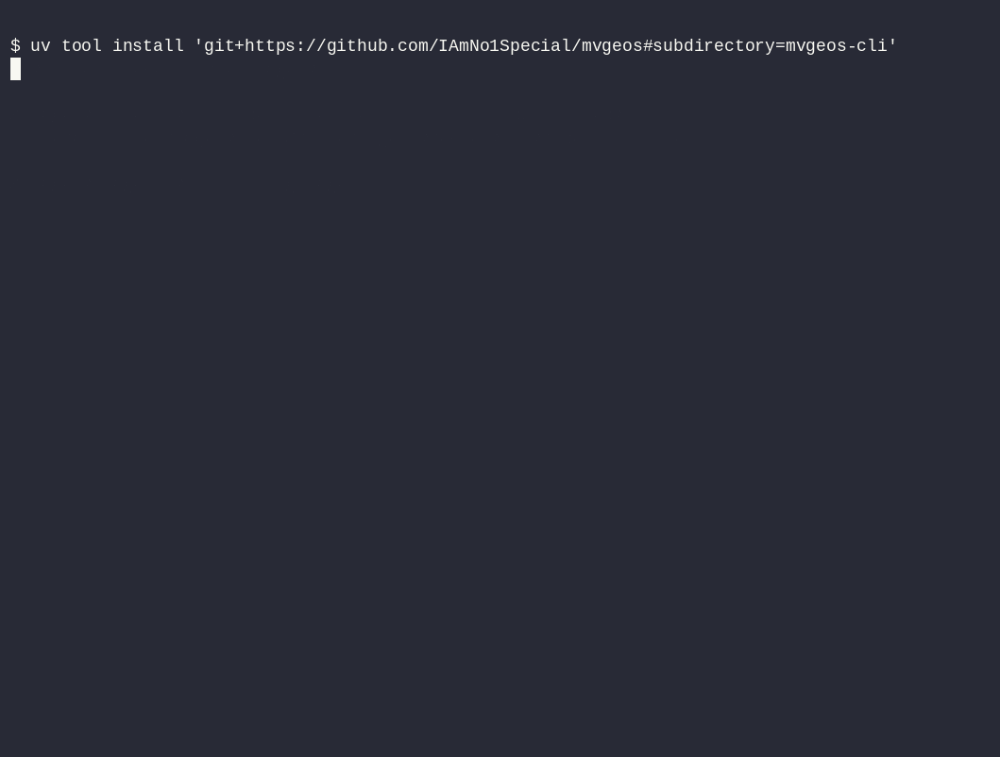
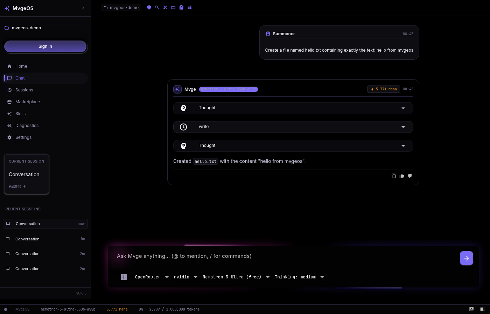
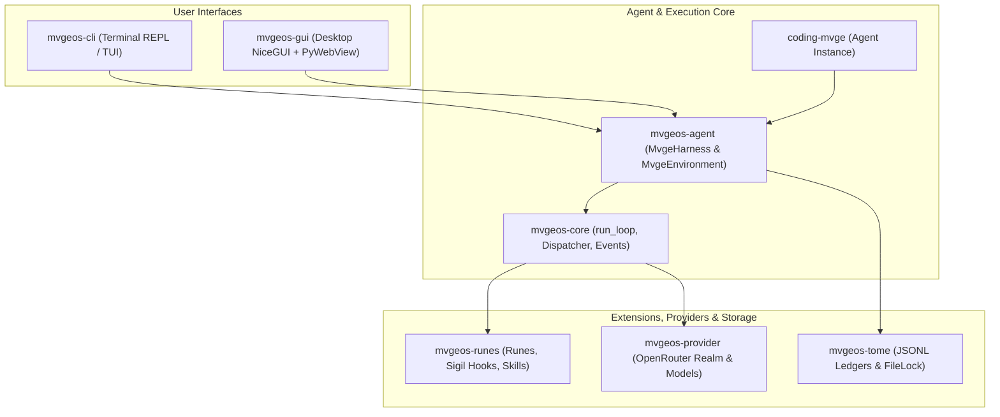

# 🧙‍♂️ MvgeOS

[](https://www.python.org/downloads/)
[](https://github.com/astral-sh/uv)
[](https://github.com/astral-sh/ruff)
[](https://mypy-lang.org/)
[](https://opensource.org/licenses/MIT)
[]()

> **An open coding-agent platform. Read it, fork it, self-host it, and run it on a model you already pay for.**

MvgeOS is an operating system for AI agents, written in Python. A **Mvge** — the
agent — casts **Spells** (tools) against models served by **Realms** (providers).
Conversations persist as **Tomes**. Capabilities extend through **Runes**.

No account to create. No telemetry in the engine. No model baked in — you bring a
key for whichever provider you already use.

## Install

```bash
uv tool install "git+https://github.com/IAmNo1Special/mvgeos#subdirectory=mvgeos-cli"
mvgeos --help
```

Or run it without installing anything:

```bash
uvx --from "git+https://github.com/IAmNo1Special/mvgeos#subdirectory=mvgeos-cli" mvgeos --help
```

> **Why is the install line this long?** The `mvgeos` console script now exists
> on the root distribution, but no release has been published to PyPI yet, so
> `uvx mvgeos` still resolves to nothing:
>
> ```text
> Because mvgeos was not found in the package registry ...
> ```
>
> Once a tagged release ships, this becomes `uvx mvgeos` and this note goes
> away. The git form above works today.

## Run one task

This is the whole sequence, recorded start to finish on a machine with an empty
`$HOME`. No cuts, no re-run, 23 seconds:



The same four commands to type yourself:

```bash
# 1. the Realm — how MvgeOS reaches a model
mvgeos rune install openrouter-realm --confirm-python-deps

# 2. the Mvge — carries the Spells
mvgeos mvge install coding_mvge

# 3. your key
export OPENROUTER_API_KEY="sk-or-..."

# run a task
mvgeos --agent-name coding_mvge "Create a file named hello.txt containing exactly the text: hello from mvgeos"
```

> **Step 2 may ask a question in a real terminal — and it does not matter.**
> `mvge install` gates its declared `python_deps` the way `rune install` does,
> so on a TTY it prompts before fetching. **Answering `n` is harmless here**, and
> the warning you get without a TTY is misleading: the four packages it names are
> already installed with the engine, and the resolved Spell set is the same nine
> either way. To fetch them anyway, `mvgeos mvge install --confirm-python-deps
> coding_mvge` does it without prompting (`v0.6.6` and later). The recording
> above pipes `yes` into the prompt so it can run unattended; you will be asked.

Here is that task, actually run, with nothing edited. The Mvge cast `write`,
checked its own work, and reported back:

```text
Created hello.txt with the content "hello from mvgeos". Verified the file contents match exactly.
Stop reason: stop
```

The file is on disk, byte for byte what was asked — 17 characters, and no
trailing newline, because the prompt said *exactly* that text:

```console
$ ls -l hello.txt
-rw-r--r-- 1 you you 17 hello.txt
$ od -c hello.txt
0000000   h   e   l   l   o       f   r   o   m       m   v   g   e   o
0000020   s
0000021
```

The same task in the desktop app, same Realm, same model:



<details>
<summary>Install and runtime output, from a clean machine</summary>

```text
$ mvgeos --help
 MvgeOS - a Python-based AI coding agent

╭─ Commands ────────────────────────────────────────────────────────────────────╮
│ build   Serialise the resolved runtime manifest (read-only).                 │
│ config  Configuration management                                             │
│ info    Display the runtime snapshot as rich tables (read-only).             │
│ mvge    Mvge (agent) management                                              │
│ rune    Extension rune management                                            │
│ setup   Install system dependencies for runes                                │
│ tome    Session tome management                                              │
╰──────────────────────────────────────────────────────────────────────────────╯

$ mvgeos rune install openrouter-realm --confirm-python-deps
Successfully installed rune 'openrouter-realm' to ~/.agents/extensions/openrouter-realm

$ mvgeos mvge install coding_mvge
Successfully installed mvge 'coding_mvge' to ~/.agents/agents/coding_mvge

$ mvgeos info --agent-name coding_mvge
Agent: coding_mvge
Model: nvidia/nemotron-3-ultra-550b-a55b:free

Spells
  bash        builtin
  edit        builtin
  find        builtin
  grep        builtin
  list_files  builtin
  read        builtin
  read_url    builtin
  search_web  builtin
  write       builtin
```

The `info` table also prints a Description column, several paragraphs long per
Spell, and then the Rune, Config, Prompt, Skills, and Diagnostics tables. Those
are elided here for width. `mvgeos build --agent-name coding_mvge` prints the
same nine Spells as JSON, with their full parameter schemas, if you want to read
them.

</details>

> Put `--agent-name` **after** a subcommand (`mvgeos info --agent-name …`).
> Before one it is silently ignored and you get `Agent: default-mvge` with no
> Spells. For a one-shot run there is no subcommand, so it goes before the
> prompt, as above.

**[Full documentation →](https://iamno1special.github.io/mvgeos-marketplace/)** —
quickstart, concepts, troubleshooting with real errors, and FAQ.

## What you get

- **A coding Mvge you can read.** Nine built-in Spells — `bash`, `edit`, `find`,
  `grep`, `list_files`, `read`, `read_url`, `search_web`, `write` — installed as
  a package, so you can see exactly what your agent is allowed to do. That is the
  list `mvgeos build --agent-name coding_mvge` resolves on a clean machine.
- **Tomes, not a chat database.** Every conversation is an append-only JSONL
  file under `~/.agents/sessions/` that you can read, diff, fork, and export.
- **Runes.** Mount MCP servers as Spells, trace with OpenTelemetry, wire in
  Agent Skills, read your `AGENTS.md`, self-modify. Fifteen in the
  [marketplace catalog](https://iamno1special.github.io/mvgeos-marketplace/#rune-catalog).
- **Realm-agnostic by construction.** The engine programs against a Realm
  abstraction, not one vendor's SDK. Your key reaches the provider you chose
  and nothing else.
- **Terminal and desktop.** Streaming REPL, full-screen TUI, and a NiceGUI +
  PyWebView desktop app with live Spell tracking and diff review.

## Honest status

- **`v0.6.8`, pre-1.0.** Internals are held to a high bar — mypy strict, ruff,
  ~2,200 tests. The command surface still moves.
- **No published distribution yet**, hence the long install line.
- **The default free model is unreliable, so step "run one task" is.** Every
  install and inspect command here is re-verified on a clean machine on a
  schedule. The model call is not: across eight clean-machine runs of the task
  above, four ended in

  ```text
  Error: Upstream error from Nvidia: Service temporarily overloaded
  ```

  and four completed and wrote the correct file. A retry clears it; the engine's
  own retry gives up before the provider does. Check before you run it again, so
  you do not pay twice for one task:

  ```console
  $ ls -l hello.txt && cat hello.txt
  ```

  Naming a different model also clears it:

  ```bash
  mvgeos -m nvidia/nemotron-3-super-120b-a12b:free --agent-name coding_mvge \
    "Create a file named hello.txt containing exactly the text: hello from mvgeos"
  ```

  `-m` accepts only ids from the model list shipped in the repository, and that
  list is a drifting snapshot. Details in the
  [troubleshooting guide](https://iamno1special.github.io/mvgeos-marketplace/troubleshooting/).
- **A known bug costs a wasted round-trip.** When a Mvge checks its own work with
  `read`, `grep`, `find`, or `list_files`, leaving the optional paging arguments
  out, the cast is rejected once and retried: a nullable optional Spell argument
  loses its nullability and then fails the second of two validation passes. The
  task still completes correctly; you pay one extra model call. Tracked as
  SOM-23.
- **Runes run in-process** via `importlib`. Not sandboxed, not
  process-isolated — a Rune has your permissions, and a manifest's
  `python_deps` is an instruction to fetch packages from PyPI. Read manifests
  before installing code you did not write. The
  [approval rune](https://iamno1special.github.io/mvgeos-marketplace/runes/approval-rune/)
  is a fail-closed gate you can put in front of mutating casts.
- **No run-level spend cap.** *Mana Budget* is not implemented; Contemplation
  is a per-request reasoning parameter, not a ceiling.

---

<details>
<summary><b>✨ Features</b></summary>

- ⚡ **Event-Driven Agent Loop (<code>mvgeos-agent</code>)**: Stream-centric execution loop with parallel spell dispatching, turn management, and automatic context compaction.
- 🌐 **Multi-Model Provider Abstraction (<code>mvgeos-provider</code>)**: Realm protocol, model registry, and retry policies. The concrete OpenRouter realm (60+ LLMs, streaming, exponential backoff, rate-limit handling, reasoning effort configuration) ships as the `openrouter-realm` rune in `mvgeos-marketplace` and registers itself at runtime.
- 📜 **JSONL Session Persistence (<code>mvgeos-tome</code>)**: JSONL session storage in a Pi-inspired format (not byte-compatible with Pi: Pi session files cannot be opened by MvgeOS and vice versa), featuring cross-process file locking, tree branching/forking, and in-memory index caching.
- 🔮 **Rune Extension Ecosystem (<code>mvgeos-runes</code>)**: Hot-reloadable extension modules with 23 lifecycle Sigil hooks and command registration. Rune code executes in-process via `importlib` — extensions are *not* process-isolated; an opt-in sandbox seam exists for code that runes voluntarily submit for sandboxed execution.
- 🖥️ **Desktop GUI (<code>mvgeos-gui</code>)**: Native desktop interface powered by NiceGUI and PyWebView offering a 1:1 Antigravity layout with interactive chat, step cards, floating dock, file tree, diff review, and artifact inspector.
- ⌨️ **Rich CLI & TUI (<code>mvgeos-cli</code>)**: Full terminal interface featuring an interactive REPL with prompt-toolkit, terminal dashboard, and system diagnostic tooling.
- 🛠️ **Full-Featured Coding Agent (<code>coding-mvge</code>)**: Pre-configured agent with built-in spells for bash execution, file reading, editing, creation, grep searching, and directory listing.

</details>

<details>
<summary><b>🏛️ Monorepo Architecture</b></summary>

MvgeOS is organized as a monorepo powered by `uv` workspaces:

| Package | Purpose |
| --- | --- |
| [`mvgeos-core`](mvgeos-core/AGENTS.md) | Canonical loop vocabulary: abort primitives, invocations, spells, events, pure turn loop (zero first-party deps) |
| [`mvgeos-agent`](mvgeos-agent/AGENTS.md) | Core Mvge loop, invocations, state, spell execution, and MvgeHarness session lifecycle |
| [`mvgeos-provider`](mvgeos-provider/AGENTS.md) | Realm protocol, model registry, retry policies, and OpenRouter provider |
| [`mvgeos-tome`](mvgeos-tome/AGENTS.md) | JSONL session persistence with cross-process file locking and in-memory index |
| [`mvgeos-runes`](mvgeos-runes/AGENTS.md) | Extension system: manifest parser, loader, watcher, and sigil hooks |
| [`mvgeos-cli`](mvgeos-cli/AGENTS.md) | CLI commands (`mvgeos`), REPL, and TUI interface |
| [`mvgeos-gui`](mvgeos-gui/AGENTS.md) | Native desktop application powered by NiceGUI with 1:1 Antigravity UI |
| [`coding-mvge`](https://github.com/IAmNo1Special/mvgeos-marketplace/tree/main/mvges/coding_mvge) | Concrete coding Mvge with built-in development Spells (ships from the marketplace, not this repo) |


```mermaid
flowchart TD
    subgraph UI["User Interfaces"]
        CLI["mvgeos-cli (Terminal REPL / TUI)"]
        GUI["mvgeos-gui (Desktop NiceGUI + PyWebView)"]
    end

    subgraph CoreEngine["Agent & Execution Core"]
        Mvge["coding-mvge (Agent Instance)"]
        Harness["mvgeos-agent (MvgeHarness & MvgeEnvironment)"]
        Loop["mvgeos-core (run_loop, Dispatcher, Events)"]
    end

    subgraph StorageEcosystem["Extensions, Providers & Storage"]
        Runes["mvgeos-runes (Runes, Sigil Hooks, Skills)"]
        Provider["mvgeos-provider (OpenRouter Realm & Models)"]
        Tome["mvgeos-tome (JSONL Ledgers & FileLock)"]
    end

    CLI --> Harness
    GUI --> Harness
    Mvge --> Harness
    Harness --> Loop
    Loop --> Provider
    Loop --> Runes
    Harness --> Tome
```

</details>

<details>
<summary><b>📖 MvgeOS Terminology</b></summary>

MvgeOS adopts a consistent domain language across all packages:

| Standard Concept | MvgeOS Term | Description |
| --- | --- | --- |
| **Agent** | `Mvge` | The autonomous agent entity |
| **User** | `Summoner` | The human interacting with the agent |
| **Tool** | `Spell` | Executable capability invoked by the Mvge |
| **Token** | `Mana` | Unit of context and computation budget |
| **Context Window** | `Mana Pool` | Total token capacity available |
| **Provider** | `Realm` | LLM backend service (e.g. OpenRouter) |
| **Session** | `Tome` | JSONL persistent session log |
| **Message** | `Invocation` | Turn message between Summoner and Mvge |
| **Streaming** | `Channeling` | Real-time token streaming from Realm |
| **Extension** | `Rune` | Plugin module extending Mvge capabilities |
| **Callback / Hook** | `Sigil` | Lifecycle event handler |
| **Reasoning Effort** | `Contemplation` | Thought generation configuration |

The authoritative definitions, including what each term is *not*, are in
[`CONTEXT.md`](CONTEXT.md).

</details>

<details>
<summary><b>⚙️ Configuration &amp; the <code>.agents</code> protocol</b></summary>

MvgeOS complies with the [dotagents protocol](https://dotagentsprotocol.com).
At filesystem and wire boundaries it uses the standard protocol names — so its
files stay readable by anything else that speaks the protocol.

```text
~/.agents/
├── extensions/          # Runes, including Realms
├── agents/<mvge>/       # installed Mvges, their Spells, Skills, runes/
├── sessions/            # Tomes, as JSONL
├── auth/                # credentials
├── skills/              # user-scope Skills
├── models.json          # model configuration
└── mcp.json             # MCP server registry
```

### Environment variables

| Variable | Type | Default | Description |
|---|---|---|---|
| `OPENROUTER_API_KEY` | string | *Required* | Primary API key for OpenRouter LLM inference |
| `MVGEOS_API_KEY` | string | *Optional* | Fallback / alias API key for MvgeOS operations |
| `GEMINI_API_KEY` | string | *Optional* | API key for Gemini models |
| `GOOGLE_API_KEY` | string | *Optional* | API key for Google Cloud / Gemini endpoints |
| `STORAGE_SECRET` | string | *Auto-generated* | Secret key used to encrypt NiceGUI desktop session storage |
| `MVGEOS_LOG_DIR` | string | `.logs` | Custom runtime log directory path |
| `MVGEOS_LOG_LEVEL` | string | `INFO` | Runtime log verbosity level (`DEBUG`, `INFO`, `WARNING`, `ERROR`) |
| `MVGEOS_DB_PATH` | string | `~/.agents/.mvgeos/state.db` | Custom SQLite database path for desktop GUI state |
| `MVGEOS_WORKSPACE_ROOT` | string | Current working directory | Authorized root directory boundary for file and bash spell operations |
| `MVGEOS_BASH_TIMEOUT_MS` | integer | `600000` (10 min) | Default spell execution timeout in milliseconds |
| `EDITOR` | string | System default | External text editor command for editing configurations or notes |

</details>

<details>
<summary><b>🧩 Rune dependencies</b></summary>

Runes can declare both Python and system dependencies. Use `mvgeos setup` to
inspect and install them:

```bash
mvgeos setup check              # check required dependencies
mvgeos setup install            # interactively install missing dependencies
mvgeos setup install --yes      # non-interactively install all dependencies
mvgeos setup install --dry-run  # dry-run preview of installation actions
```

</details>

<details>
<summary><b>🧪 Development</b></summary>

All code in MvgeOS is developed using strict TDD and adheres to rigorous quality
gates:

```bash
uv sync                                  # workspace dependencies
uv run python -m pytest --cov            # full suite with coverage
uv run mypy .                            # type checker, strict mode
uv run ruff check                        # linter
uv run ruff format --check               # formatting
```

### Interfaces

The desktop GUI is a separate package and is not part of the CLI install above —
run it from a source checkout:

```bash
uv run mvgeos                       # streaming REPL
uv run mvgeos --tui                 # full-screen TUI
uv run mvgeos-gui                   # native desktop app (NiceGUI + PyWebView)
uv run mvgeos-gui --web --port 8000 # serve the GUI to your browser
```

See [`TESTING.md`](TESTING.md) for the testing standards charter and
[`CONTRIBUTING.md`](CONTRIBUTING.md) to get set up.

</details>

<details>
<summary><b>🔒 Security, provenance, releases, licence</b></summary>

- **Security policy**: vulnerability reporting, prompt injection threat models,
  and local execution safeguards — see [`SECURITY.md`](SECURITY.md).
- **Architecture provenance**: origins of MvgeOS, its ecosystem inspirations
  (Pi, Google ADK, Eve, arXiv literature), and the cross-harness session
  continuity roadmap — see [`docs/architecture/PROVENANCE.md`](docs/architecture/PROVENANCE.md).
- **Changelog**: managed via [`git-cliff`](https://github.com/orhun/git-cliff)
  from conventional commits; automated on pushes to `main`.

```bash
uv run git-cliff --config cliff.toml --unreleased     # preview unreleased
uv run git-cliff --config cliff.toml --output CHANGELOG.md   # regenerate
```

**Licence**: MIT — see [`LICENSE`](LICENSE).

</details>

---

<div align="center">
  <sub>Made with ❤️ for developers and autonomous agent builders.</sub>
</div>